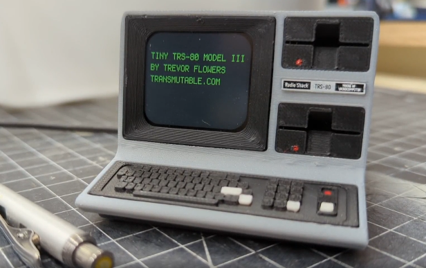

# trsmutableiii

Python scripts for [Trevor Flowers' Electronic Tiny TRS-80 Model III](https://store.transmutable.com/l/e-trs-80-model-iii).

## Overview

These Python scripts are intended for [Trevor Flowers' Electronic Tiny TRS-80 Model III](https://store.transmutable.com/l/e-trs-80-model-iii).

It just so happens that they're specifically designed to run within that 1:6 scale model; screen orientation matters and the model covers some of the screen! However, even if you do not have that particular model, you might find these scripts useful for your own projects on that same hardware.

These scripts depend on the Adafruit QT Py microcontroller and the Adafruit Monochrome 1.3" 128x64 OLED graphic display. 

## Prerequisites

To run the scripts in this repository, you will need the following hardware:
- [Adafruit QT Py ESP32-S3 WiFi Dev Board with STEMMA QT - 8 MB Flash / No PSRAM](https://learn.adafruit.com/adafruit-qt-py-esp32-s3)
- [Adafruit 240x240 Wide Angle TFT LCD display with MicroSD](https://learn.adafruit.com/adafruit-1-3-and-1-54-240-x-240-wide-angle-tft-lcd-displays)

Or, simply purchase a complete [1:6 scale model of a TRS-80 Model III](https://store.transmutable.com/l/e-trs-80-model-iii), which includes the microcontroller and display:



## Getting Started

To get started, clone this repository to your local machine:

```bash
git clone git@github.com:cloudartisan/trsmutableiii.git
cd trsmutableiii
```
## Scripts

### wargames

This script is a simple implementation of the computer screens seen in the movie WarGames, all from David Lightman's point of view. As much as possible, I've tried to mimic the screens from the movie. However, the display limitations sometimes made it necessary to condense/abbreviate parts of the screens.

The screens are displayed in blue to match the movie (notice that most of the computer text in the movie is blue, not monochrome green, white, or amber).

The screens simulate a typing / baud rate rather than immediately displaying the text.

#### Install

To install the script, copy the _content_ of the `wargames` directory to the `CIRCUITPY` drive on your device.

For example, on a Mac:

```bash
cp -r wargames/* /Volumes/CIRCUITPY/
```

The auto-reload should kick in and the program should start running on the device.


## Debugging via Serial Console
To debug the device via the serial console, follow the instructions below.

### Mac or Linux
Follow the instructions [here](https://learn.adafruit.com/welcome-to-circuitpython/advanced-serial-console-on-mac-and-linux) to set up the serial console on Mac or Linux.

### Windows
Follow the instructions [here](https://learn.adafruit.com/welcome-to-circuitpython/advanced-serial-console-on-windows) to set up the serial console on Windows.

### VSCode/Mu/Arduino IDE

If you use VSCode, you can install the CircuitPython extension and use its built-in serial console. After installing the extension, at the bottom of your VSCode window you will need to:
- Choose Circuit Python Board (in my case, `Adafruit:QT Py ESP32S3 no psram`)
- Select Serial Port (in my case, it looked like `/dev/tty.usbmodemXXXXXXX`)

If you use the [Mu editor](https://codewith.mu/), you can [use the serial console built into the editor](https://codewith.mu/en/tutorials/1.2/circuitpython).

If you use the [Arduino IDE](https://www.arduino.cc/en/software), you can use the serial monitor built into the IDE. You will first need to install the appropriate CircuitPython board and libraries in the Arduino IDE. This _should_ happen automatically if your device is connected to the computer and the Arduino IDE is open.

### REPL

Depending on how you've accessed the serial console, you might be able to access the REPL. Using the REPL you can run Python commands directly on the device for further debugging.

In my case, I connected via the serial console using `screen` then used `Ctrl-C` to interrupt the running program and access the REPL:

```
KeyboardInterrupt:

Code done running.

Press any key to enter the REPL. Use CTRL-D to reload.

Adafruit CircuitPython 8.2.6 on 2023-09-12; Adafruit QT Py ESP32-S3 no psram with ESP32S3
>>>
```

## Upgrading CircuitPython

At the time of writing, the latest stable version of CircuitPython is 9.0.5. The version that was already installed on my device was 8.2.6.

You can check the latest releases [here](https://github.com/adafruit/circuitpython/releases).

If you decide to upgrade CircuitPython on your device, follow the instructions [here](https://circuitpython.org/board/adafruit_qtpy_esp32s3_nopsram/).

## License

This project is licensed under the MIT License - see the [LICENSE](LICENSE) file for details.